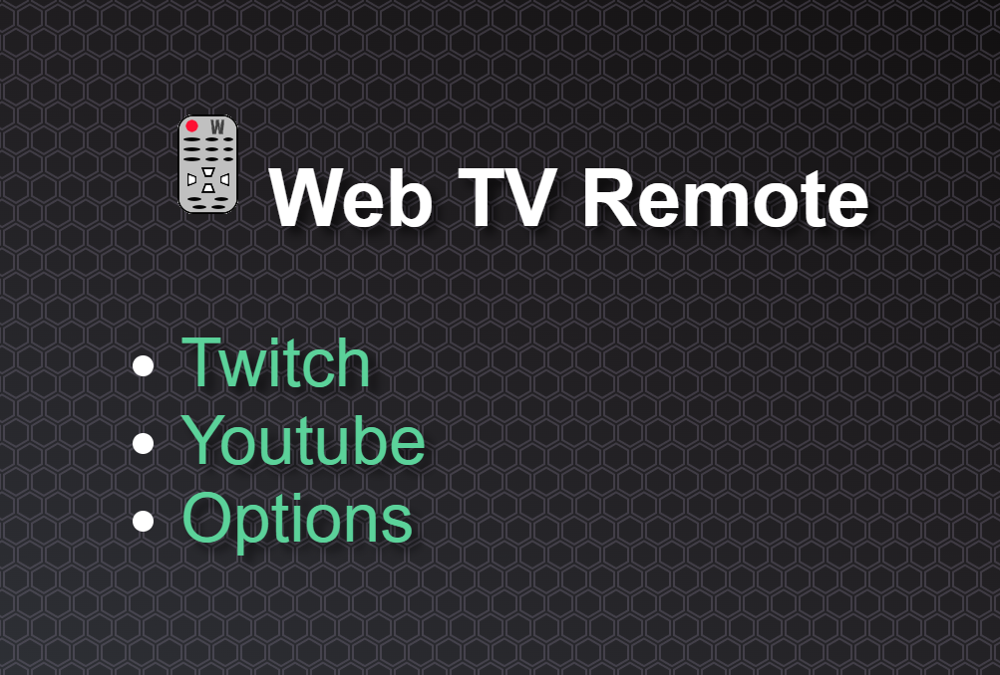

# Web TV Remote #

Control streaming websites with keyboard/remote.

This extension just displays the native web browser view and allows you to navigate through links with Arrow keys & Enter. 
Minimal compatibility problems and you are already familiar with how to navigate & login.

## Installation ##

Chrome: https://chromewebstore.google.com/detail/webtvremote/ocjgpmhfpnjinnonlaljhelgccinoome

Firefox: https://addons.mozilla.org/en-US/firefox/addon/web-tv-remote/

## Usage ##

Upon startup of browser, it will automatically load the startup screen.

Navigate with the following keys:

 - Home: Go to startup screen
 - ArrowDown: Next link/button
 - ArrowUp: Prev link/button
 - ArrowRight: Next group of links/button
 - ArrowLeft: Prev group of links/button

Also native media keys such as Play/Pause should still work.

Current Supported Sites:

 - Twitch
 - Youtube

# Building #
Build Environment
- Windows 10
- NPM version 8.1.2

Build Steps
- Install NPM
- Run `npm install` in base directory
- Run `npm run build_ff` for Firefox
- Run `npm run build` for Chrome
